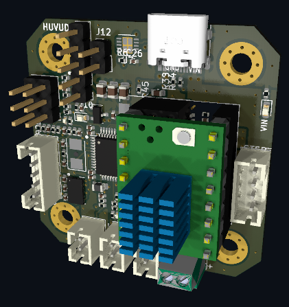

# Huvud 3D Printer toolhead board USB-PD

A very small 3D printer board for use on a direct drive toolhead. 
It is designed to be used with Klipper firmware.
Klipper has the awesome feature to be able to use multiple MCUs connected to the host over a (relatively) high latency connection. 
This version uses USB-PD instead of CAN. 
Why? USB-C adoption makes premade, robust, and flexible cables capable of supplying power and data generally availabile as commodities.
Also, for fun.
It runs at 20 V instead of 24 V, so maximum fan speed is a little slower. 
24 V is technically possible with USB-PD 3.1 EPR AVS, but the hardware is not commonplace. 

---

Based on the amazing work of [bondus](https://github.com/bondus/KlipperToolboard)

Buy it at:

* Lukes Lab: https://lukeslabonline.com/products/huvud
* Tindie: https://www.tindie.com/products/huvud/huvud-3d-printer-hotend-control-board/

Read more about the project activites over at hackaday:
https://hackaday.io/project/174429-huvud-a-3d-printer-tool-head-controller-board

---
